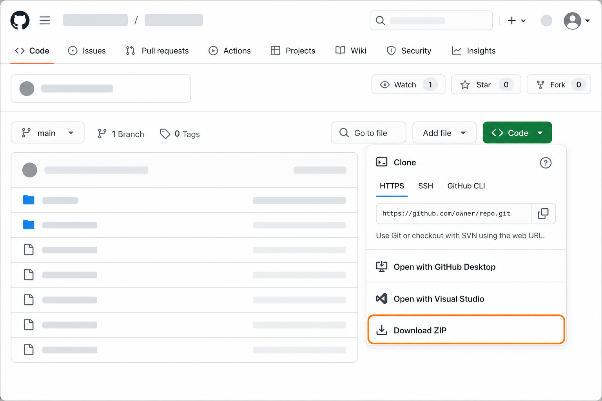
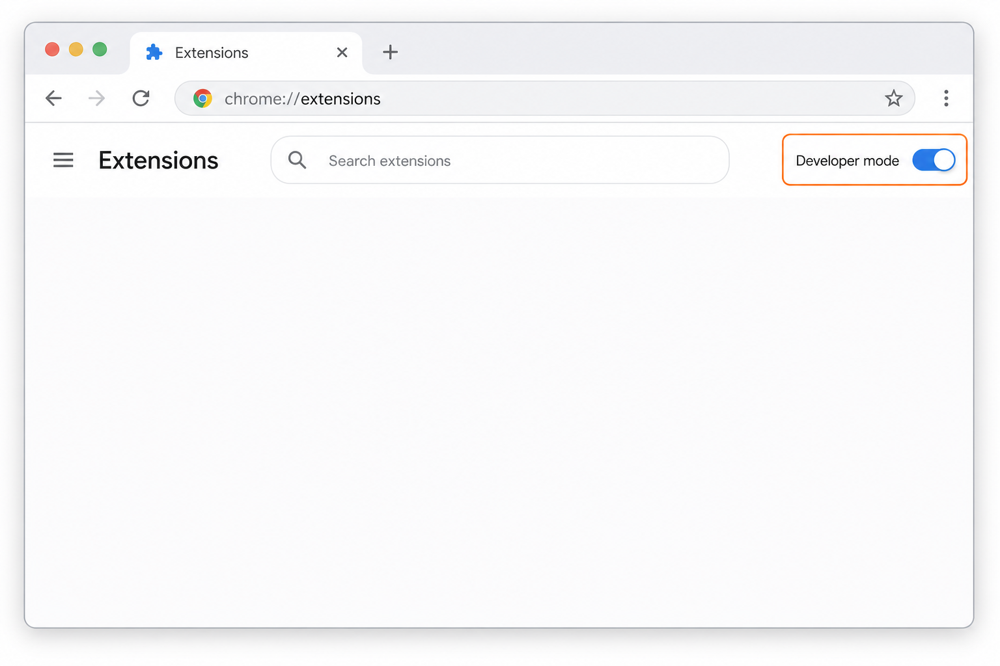
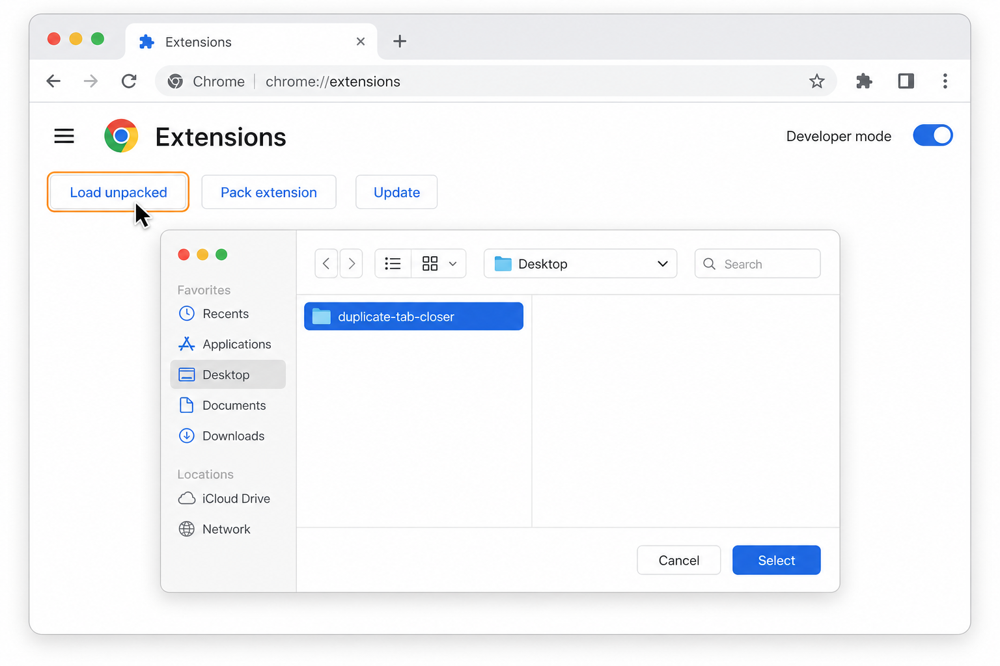

# deeExe Duplicate Tab Closer

A Chrome extension that finds tabs with the same URL and closes the extras — you pick which groups to clean up, and one tab from each group always stays open.

## Features

- One-click scan from the toolbar popup, with a live count of duplicate groups
- Review page that lists every duplicate group with title, favicon, and tab count
- Choose exactly which groups to close — the oldest tab in each group is kept
- List updates live as tabs open and close
- Keyboard- and screen-reader-friendly throughout

## Install (no Chrome Web Store needed)

> The images below are illustrations of the Chrome UI.

### 1. Download this repository

Click the green **Code** button at the top of this page, then **Download ZIP**. Unzip it somewhere you'll keep it (e.g. your Documents folder) — Chrome loads the extension from this folder, so don't delete it afterwards.



### 2. Turn on Developer mode

Open a new tab and go to `chrome://extensions` (paste that into the address bar). Flip the **Developer mode** toggle in the top-right corner.



### 3. Load the extension

Click the **Load unpacked** button that appears, and select the unzipped folder from step 1.



That's it — the extension icon appears in your toolbar (click the puzzle-piece icon to pin it).

## Using it

1. Click the extension icon. The popup shows how many duplicate groups you have.
2. Click **Find duplicate tabs** to open the review page.
3. Check the groups you want to clean up (or use **Select all**), then click the green close button. The oldest tab in each selected group stays open; the rest close.

## Updating

This extension doesn't auto-update. To get a new version, download the ZIP again, replace your folder's contents, then click the refresh icon on the extension's card at `chrome://extensions`.

## Privacy & permissions

The extension uses only the `tabs` permission, to read tab URLs and titles so it can find duplicates. Nothing is collected, stored, or sent anywhere — everything happens locally in your browser. (Chrome's install warning about "reading browsing history" is its blanket phrasing for any extension that can see tab URLs.)

The full privacy policy lives in [PRIVACY.md](PRIVACY.md)

## Releasing

To package a new version for the Chrome Web Store:

1. Bump the version — the store rejects uploads that don't increment `manifest.json`'s version:

   ```
   scripts/bump-version.sh patch   # or minor / major
   ```

2. Build the zip. It contains only the shipped files (manifest, popup, review page, icons):

   ```
   scripts/build.sh
   ```

   The result lands in `dist/duplicate-tab-closer-v<version>.zip`. The `dist/` folder is gitignored — build artifacts are never committed.

3. Upload the zip in the [Chrome Web Store developer dashboard](https://chrome.google.com/webstore/devconsole), then commit and tag the version bump.

## License

[MIT](LICENSE)
